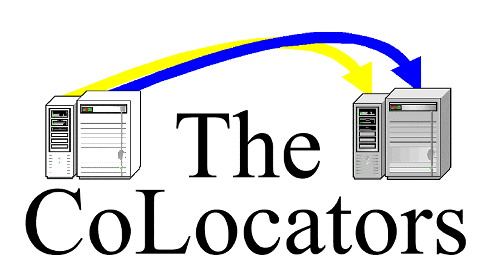

Project Co-Locators
=======================


### Run ERDDAP colocate in Binder!

[](https://mybinder.org/v2/gh/oceanhackweek/ohw19-project-co_locators/master?filepath=colocate.ipynb)

### Installation:
```
cd ohw19-project-co_locators
conda env create -f environment.yml
python setup.py install

erddap-co-locate
```

## Jupyter notebook:
```
jupyter notebook &
```

## Run with voila:
```
voila colocate.ipynb --enable_nbextensions=True --VoilaConfiguration.file_whitelist="['.*']"
```

### Collaborators on this project
Mathew Biddle <br />
Sophie Chu <br />
Yeray Santana Falcon <br />
Molly James <br />
Pedro Magaña, Widget Wizard <br />
Jazlyn Natalie <br />
Laura Gomez Navarro  <br />
Shikhar Rai  <br />
Micah Wengren <br />

## Team Co-Locators:



### The problem
Co-locate oceanographic data by establishing constraints.

### Application example
A user is interested in all the available oceanographic data in a region where an eddy just formed. They provide the geospatial bounds of the region and a temporal range and get an aggregated response of all available data.

### Specific tasks
- [x] Collect temporal bounds.
- [x] Collect spatial bounds.
- [x] _Collect keywords?_
- [x] Build query url.
- [x] Do the search.
- [ ] Evaluate the response.
- [ ] Manage response.
- [ ] Geospatial plotting.
- [ ] Temporal plotting.
- [ ] Link back to dataset on erddap server.
- [ ] _Aggregated download?_


### Existing methods
- The Irish Marine Institute has developed a [keyword search across existing ERDDAP
  servers](https://github.com/IrishMarineInstitute/search-erddaps)
  - [Here is the list of all ERDDAP's they use.](https://github.com/IrishMarineInstitute/search-erddaps/blob/master/erddaps.json)
- OHW18 built a [search interface for one ERDDAP server](https://github.com/oceanhackweek/ohw18_erddap-explorer)
- yodapy: https://github.com/cormorack/yodapy


### Proposed methods/tools
- Jupyter
- Python
  - [erddapy](https://github.com/ioos/erddapy)
  - [Pandas](https://pandas.pydata.org/pandas-docs/stable/getting_started/overview.html)?
- hvplot
  - interactive plotting for output
  - map and overlaid points

### Background reading

Optional: links to manuscripts or technical documents for more in-depth analysis.
